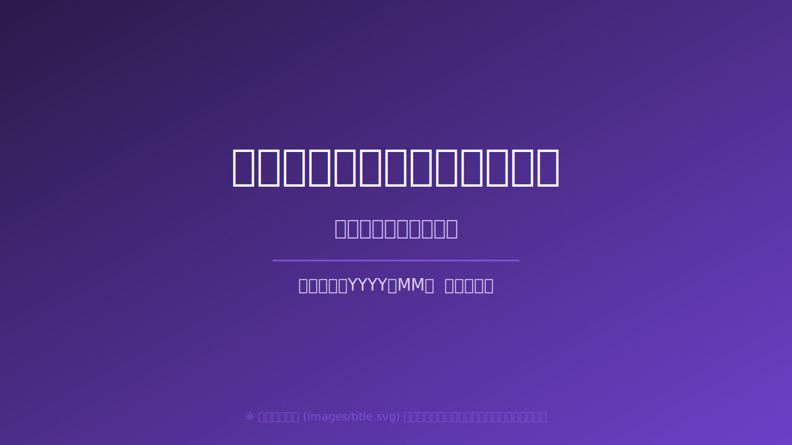

<!-- class: cover-slide -->
<!-- paginate: skip -->

<!--
表紙スライド: images/title.svg を差し替えてください。
推奨サイズ: 1280x720px
-->

---
<!-- class: "" -->
<!-- paginate: true -->

## 本日のゴール

ここに本日のプレゼンテーションのゴールを記述してください。

- <strong>伝えたいこと1</strong>の説明
- <strong>伝えたいこと2</strong>の説明
- <strong>伝えたいこと3</strong>の説明

<!--
話者ノートはここに書きます。
本日のゴールを簡潔に伝え、次のスライドへ繋げましょう。
-->
